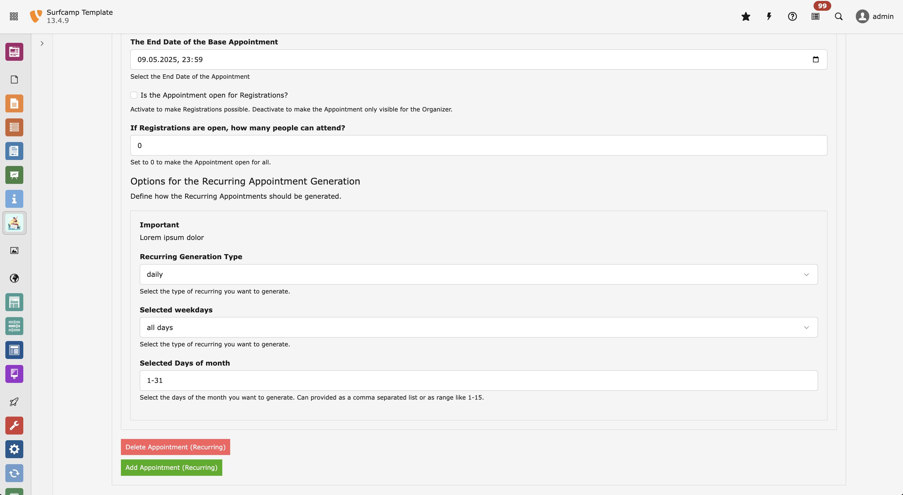

# EXT:EventWave

Extension for managing Events in the TYPO3 Backend.

EXT:EventWave offers the possibility to automatically generate single and reoccurring events, based on predefined time patterns, like "every other week", "only Wednesdays", etc..

It also features a really robust way of handling timezones, allowing for Events in different regions.

Furthermore, each event type can optionally include user registration.

In addition to a standard list view, events can also be displayed as a timeline or on a map (if locations are assigned)

1. Single & Recurring Events
2. Events Registration
3. Map & Timeline view
4. Timezone support

## Requirements

-   TYPO 13

## Installation

`composer require typo3-incubator/event-wave`

## Preview

  
Click here to get a preview of what the extension looks like

### Appointments Generator

### Backend Module Overview

### Event Registrations

### Map View

### Timeline View

### Different Timezone

